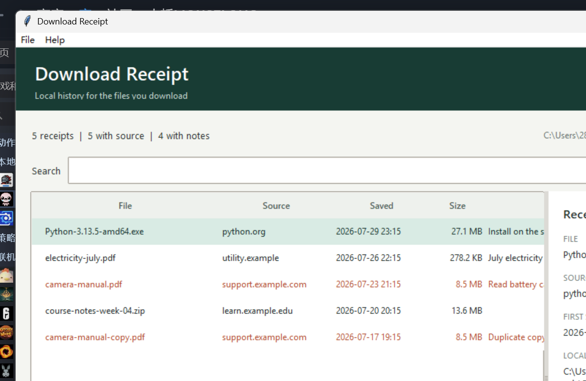

# Download Receipt（下载收据）

**给 Windows 下载的每个文件保存一张可搜索的本地收据。**

[English README](README.md)

Windows 浏览器经常把下载来源网址保存在一个隐藏的 NTFS 数据流里，但文件资源管理器不会
显示它。当文件被移动到其他文件系统时，这些信息还可能消失。Download Receipt 会在来源
信息仍然存在时将其保存到本地数据库。



## 功能

- 监控指定的下载文件夹并记录新文件。
- 读取 `Zone.Identifier` 中的 `HostUrl`、`ReferrerUrl` 和 `ZoneId`。
- 按文件名、来源网站、网址或个人备注搜索。
- 一键打开文件、所在文件夹或来源网页。
- 使用 SHA-256 文件指纹识别 200 MB 以内的重复文件。
- 所有信息只保存在本机 SQLite 数据库，不需要账号，不收集遥测数据。

## 安装与运行

发布到 GitHub 后，普通用户可以直接从 Releases 页面下载
`DownloadReceipt.exe`，无需安装 Python。

开发者从源码运行：

```powershell
git clone https://github.com/Mouselong/download-receipt.git
cd download-receipt
python -m venv .venv
.\.venv\Scripts\Activate.ps1
python -m pip install -e .
python -m download_receipt
```

数据库和设置保存在 `%LOCALAPPDATA%\DownloadReceipt`。在应用中删除一条收据不会删除
原文件。

## 工作原理

```text
下载文件夹
    |
    v
文件扫描器 ----> Windows 隐藏来源读取器
    |                         |
    +------------+------------+
                 v
            本地 SQLite 数据库
                 |
                 v
          搜索、备注、重复项提示
```

程序优先使用 `ReferrerUrl` 作为来源网页，没有时使用 `HostUrl`。即使浏览器没有保存
网址，文件也会被记录，并明确显示为“来源未知”。

## 已知限制

- 这是 Windows 优先的应用，因为隐藏数据流属于 NTFS 功能。
- 浏览器和下载工具不一定会保存来源网址。
- 文件复制到 FAT/exFAT、被解除锁定或经过部分压缩工具处理后，隐藏来源可能消失。
- 0.1 版只扫描所选文件夹的第一层；递归扫描和浏览器历史回退属于后续计划。

本项目只保存文件来源，不判断文件是否安全，也不能替代杀毒软件。

## 开发

运行测试：

```powershell
python -m unittest discover -s tests -v
```

项目采用标准 `src` 目录结构，并将界面、扫描、解析和数据库代码分开。GitHub Actions
会在 Windows 上自动测试代码；推送 `v0.1.0` 这样的版本标签后，会自动生成 Windows
可执行文件并发布到 GitHub Releases。

## 许可证

MIT
